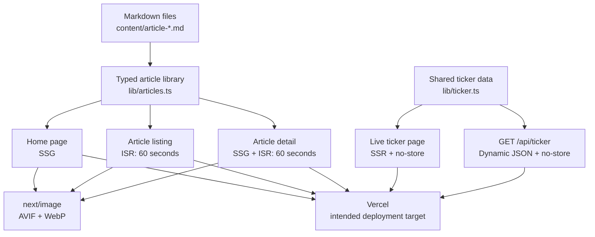

# Signal Content Hub Architecture

## Rendering boundaries

- **SSG:** stable home content and every known Markdown article path are
  generated at build time.
- **ISR:** the article listing and details revalidate after sixty seconds so
  editorial updates do not require a full rebuild.
- **SSR:** the ticker opts out of storage and renders a fresh timestamp on each
  request.
- **Shared server data:** the live page and API use `lib/ticker.ts`, preventing
  a build-time fetch to an application server that is not running yet.
- **Deployment:** Vercel is shown only as the intended target. This local-only
  curriculum run did not deploy the application.
